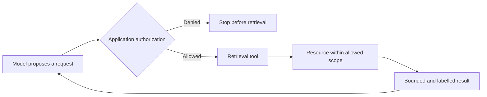
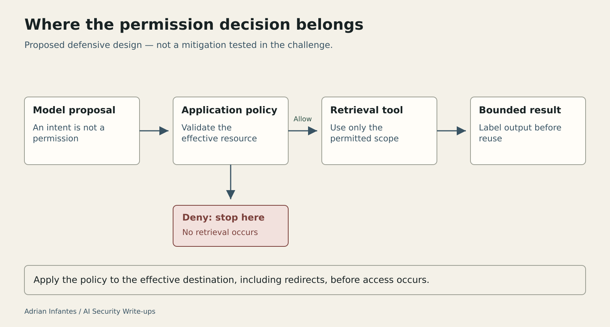

# Doctrine Studio: A Prompt Is Not a Permission Boundary

Original: https://medium.com/@infantesromeroadrian/doctrine-studio-a-prompt-is-not-a-permission-boundary-6d51785b9e4e

Status: published on Medium and public readback verified on 2026-10-03. These files preserve the editorial additions and source specifications; they are not full article replacements.

## Insert after the opening paragraph

**What is analysed:** the boundary between an agent proposing a retrieval request and the application authorizing access to a resource.

**What the evidence establishes:** the published account combines supplied code and observed behavior on an official challenge instance. It reports technical validation, without fresh platform acceptance. No mitigation was tested.

**What the reader should take away:** tool authorization must be enforced outside the model, before retrieval. A tool's name and a system instruction do not constrain the capabilities of its underlying library.

## Insert after “The model cannot replace authorization”

### Where the permission decision belongs

The following diagram describes a proposed defensive design, not the implementation tested in the challenge. The model proposes a request; an application-controlled policy decides whether the retrieval tool may act. That policy has to hold for the effective destination, including redirects, rather than merely the wording of the request.

**Figure caption:** Proposed separation of model decisions, application authorization, and tool execution. Authorization applies to the resource actually retrieved; redirects must preserve the same restrictions.

**Alt text:** A model sends a proposed request to an authorization decision. Denied requests stop. Allowed requests reach a retrieval tool, which accesses an allowed resource and returns a bounded, labelled result to the model.

**Medium text alternative:** Model proposal → application authorization → allowed tool execution → permitted resource → bounded result. A denial stops the request before retrieval.

The decisive evidence for a future fix would be a policy denial before access occurs. A refusal in the final response would not demonstrate that boundary: the resource may already have entered the tool output or model context. The published reproduction establishes the original failure; this diagram provides acceptance criteria for a separate defensive evaluation.

## Prepared illustration — editorial asset

[Editable SVG](assets/doctrine-authorization-boundary.svg). Use the caption and text alternative above alongside the illustration.

## Editorial preservation note — do not insert

Keep the original Scope and attribution and References sections intact: Hack The Box; original author Rayhan0x01; Codex-assisted reproduction and analysis at Adrián Infantes's request. Retain the distinction between technical validation and fresh platform acceptance, and the statement that no fix was tested.
