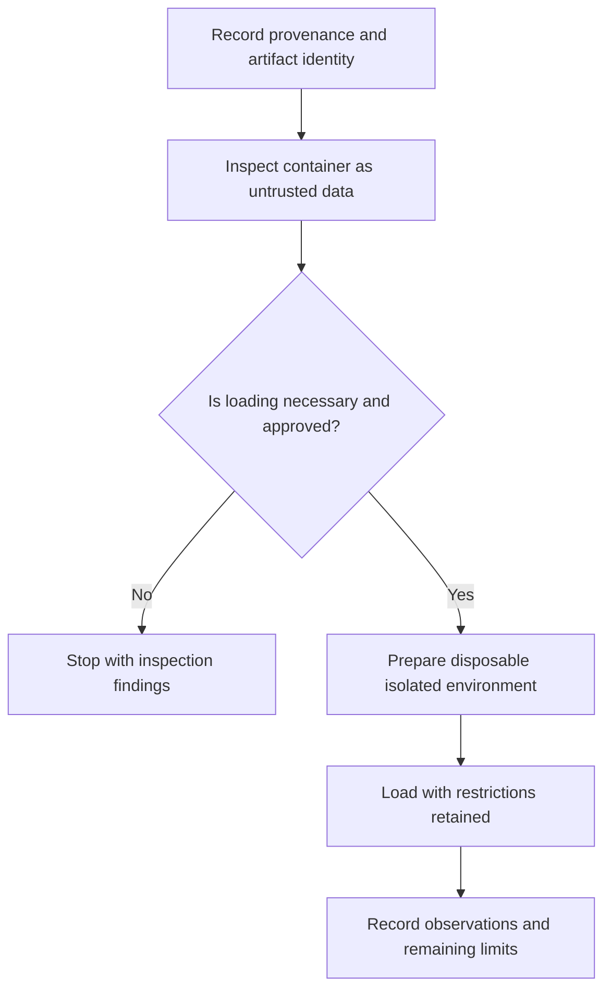
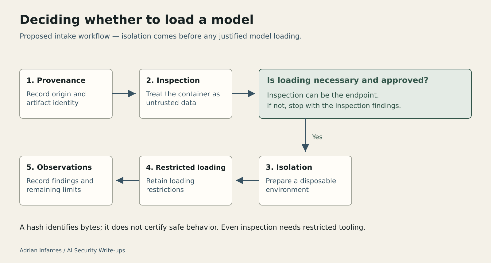

# Neural Detonator: Models Can Carry Code

Original: https://medium.com/@infantesromeroadrian/neural-detonator-un-modelo-tambi%C3%A9n-puede-esconder-c%C3%B3digo-9150c5660ba8

Status: published on Medium and public readback verified on 2026-10-03. These files preserve the editorial additions and source specifications; they are not full article replacements.

## Insert after the opening paragraph

**What is analysed:** a serialized model whose configuration, embedded code, and weights together carried behavior beyond ordinary inference.

**What the evidence establishes:** the published account reports static inspection and local validation of the result without loading the model in Keras or invoking its embedded bytecode. Local analysis tools did run; fresh platform acceptance was not obtained.

**What the reader should take away:** establish provenance and inspect an artifact before deciding whether to load it. A hash identifies bytes; it does not certify safe behavior.

## Insert at the end of “Defensive lessons: inspect before loading”

### Deciding whether to load a model

The reproduction stopped short of model loading because inspection was sufficient for its analytical objective. The figure below extends that distinction into a proposed intake workflow. Its controls were not validated as a mitigation in this challenge.

**Figure caption:** Proposed model intake workflow. Inspection can be the endpoint. If loading is justified, isolation comes before loading, and loading restrictions remain in place.

**Alt text:** Record an artifact's provenance and identity, then inspect its container. If loading is unnecessary or unapproved, stop with the findings. Otherwise, prepare a disposable isolated environment before restricted loading and record observations and limits.

**Medium text alternative:** Provenance and identity → inspection → decision. Stop if inspection answers the question. If loading is necessary and approved, prepare isolation first, then load with restrictions retained and document the outcome.

Provenance answers where the artifact came from. Integrity checks help determine whether the bytes match a recorded artifact. Inspection asks what those bytes contain. Isolation limits the consequences of a justified dynamic evaluation. Each addresses a different question; none alone establishes that a model is safe.

Even inspection processes untrusted input and needs appropriately restricted tooling. In this case, the evidence supports a narrower statement than “nothing was executed”: the analysis tools ran, while the artifact's bytecode and Lambda were not invoked and the model was not loaded with Keras.

## Prepared illustration — editorial asset

[Editable SVG](assets/neural-model-intake.svg). Use the caption and text alternative above alongside the illustration.

## Editorial preservation note — do not insert

Keep Scope and attribution and References intact: Hack The Box; original author karamuz; Codex-assisted reproduction and analysis at Adrián Infantes's request. Preserve the Python-version limitation, the distinction between analysis tools and artifact execution, and the absence of fresh platform acceptance.
