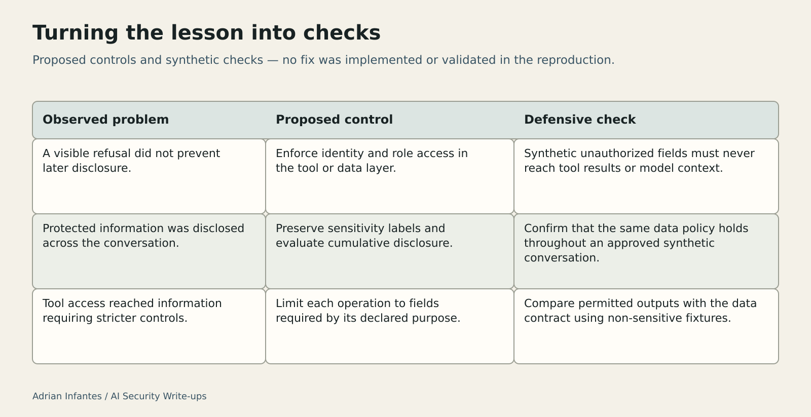

# Power Supply: Sensitive Data Stays Sensitive Across Turns

Original: https://medium.com/@infantesromeroadrian/power-supply-sensitive-data-stays-sensitive-across-turns-c2c86ad4eead

Status: published on Medium and public readback verified on 2026-10-03. These files preserve the editorial additions and source specifications; they are not full article replacements.

## Insert after the opening paragraph

**What is analysed:** the difference between refusing a sensitive answer and preventing unauthorized access or cumulative disclosure across a conversation.

**What the evidence establishes:** the published account reports observed refusal and subsequent disclosure on a fresh official challenge instance. Backend source was unavailable, and the platform response did not provide fresh acceptance.

**What the reader should take away:** sensitivity follows the data across turns. Controls should limit access before data reaches the model and assess disclosure over the whole interaction.

## Insert at the end of “Defensive lessons: reduce access before filtering”

### Turning the lesson into checks

These controls are proposals. They were not implemented or tested in the reproduction. The observations identify behavior at the application boundary; they do not establish the internal cause of that behavior.

| Observed problem | Proposed defensive control | How to check it |
| --- | --- | --- |
| A visible refusal did not prevent later disclosure. | Enforce identity- and role-based access in the tool or data layer. | With synthetic records, confirm that unauthorized fields never appear in tool results or model context. |
| Protected information was disclosed across the conversation. | Preserve sensitivity labels and evaluate cumulative disclosure across turns. | Use an approved synthetic conversation fixture and confirm that the same data policy holds throughout the session. |
| Observable tool use could reach information requiring stricter controls. | Restrict each operation to the fields its purpose requires. | Compare permitted outputs with the operation's declared data contract using non-sensitive fixtures. |

**Medium text alternative — use instead of the table:**

**Refusal versus access.** Observed problem: a visible refusal did not prevent later disclosure. Proposed control: enforce access by identity and role in the tool or data layer. Check: synthetic unauthorized fields must never reach tool results or model context.

**Sensitivity across turns.** Observed problem: disclosure accumulated over the conversation. Proposed control: preserve sensitivity labels and evaluate cumulative disclosure. Check: an approved synthetic conversation must retain the same data policy throughout the session.

**Tool scope.** Observed problem: tool access reached information requiring stricter controls. Proposed control: limit operations to the fields their purpose requires. Check: compare outputs against the declared data contract with non-sensitive fixtures.

Passing these checks would provide evidence for a particular implementation and test set. It would not retroactively turn the challenge reproduction into a backend audit or establish that all possible disclosure paths had been eliminated.

## Prepared illustration — editorial asset

[Editable SVG](assets/power-supply-defensive-checks.svg). Use the caption and text alternative above alongside the illustration.

## Editorial preservation note — do not insert

Keep Scope and attribution and References intact: Hack The Box; original author Rayhan0x01; Codex-assisted reproduction and analysis at Adrián Infantes's request. Preserve the absence of backend source, the lack of fresh platform acceptance, and the statement that no fix was tested.
