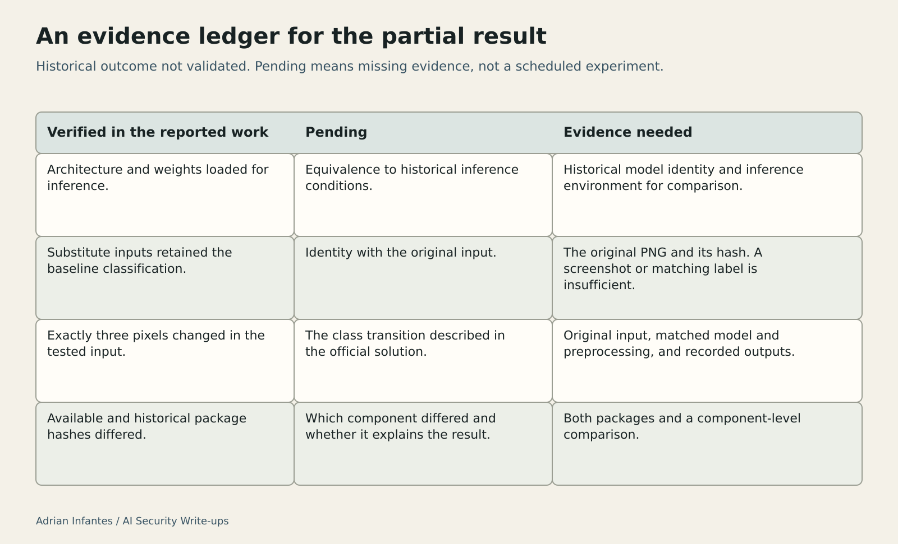

# Sigma Technology: A Partial Reproduction and Missing Evidence

Original: https://medium.com/@infantesromeroadrian/sigma-technology-a-partial-reproduction-and-missing-evidence-87bfe57eed8b

Status: published on Medium and public readback verified on 2026-10-03. These files preserve the editorial additions and source specifications; they are not full article replacements.

## Insert after the opening paragraph

**What is analysed:** a partial reproduction of a documented image-classification result, using available model artifacts and substitute inputs because the original PNG was missing.

**What the evidence establishes:** the model loaded for inference, its preprocessing and baseline behavior were checked, and a three-pixel modification was confirmed. The reported class transition was not reproduced. The available package differed from the historical package by hash.

**What the reader should take away:** a matching baseline label is not proof of identical inputs or models. An incomplete reproduction establishes neither that the historical result was wrong nor that the model is robust.

## Insert after “What was checked and what remains unresolved”

### An evidence ledger for the partial result

“Verified” below refers to the checks reported in this reproduction. “Pending” identifies missing evidence; it does not imply that another run has been scheduled or that the missing material is available.

| Verified | Pending | Evidence needed |
| --- | --- | --- |
| Architecture and weights loaded for inference in the reproduction environment. | Equivalence to the historical inference conditions. | Historical model identity and inference environment, compared with the available artifacts. |
| Substitute images retained the baseline classification. | Identity with the original input. | The original PNG and its hash; a screenshot or matching label is insufficient. |
| Exactly three pixels changed in the tested input. | The class transition described in the official solution. | Original input, matched model and preprocessing, and recorded outputs demonstrating the stated criterion. |
| Available and historical package hashes differed. | Which component differed, and whether it explains the result. | Both package contents and component-level comparison. |

**Medium text alternative — use instead of the table:**

**Model and environment.** Verified: inference loading worked. Pending: equivalence to historical conditions. Evidence needed: historical model identity and inference environment for comparison.

**Input.** Verified: substitute images retained the baseline class. Pending: identity with the original input. Evidence needed: the original PNG and its hash.

**Outcome.** Verified: exactly three pixels changed. Pending: the documented class transition. Evidence needed: the original input, matched model and preprocessing, and recorded outputs meeting the stated criterion.

**Package identity.** Verified: package hashes differed. Pending: the differing component and its relevance. Evidence needed: both packages and a component-level comparison.

The missing PNG is a concrete evidence gap. A possible model difference remains an explanation to investigate, not a demonstrated cause. Neither gap can be closed by counting the checks that passed. Until the decisive transition is supported under identifiable conditions, the appropriate result remains **partial reproduction; historical outcome not validated**.

## Prepared illustration — editorial asset

[Editable SVG](assets/sigma-evidence-ledger.svg). Use the caption and text alternative above alongside the illustration.

## Editorial preservation note — do not insert

Keep Scope and attribution and References intact: Hack The Box; original author shazb0t; Codex-assisted reproduction and analysis at Adrián Infantes's request. Preserve the missing original PNG, the uncertainty about model differences, and the absence of a fresh instance or fresh platform acceptance. Do not imply validation of the original modification or historical outcome.
